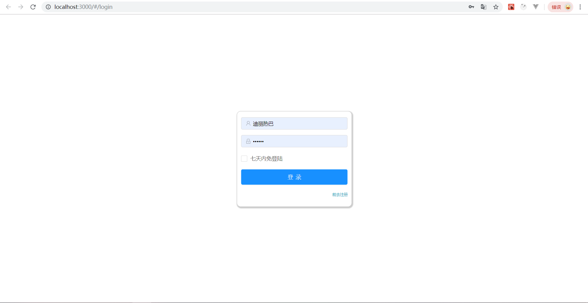
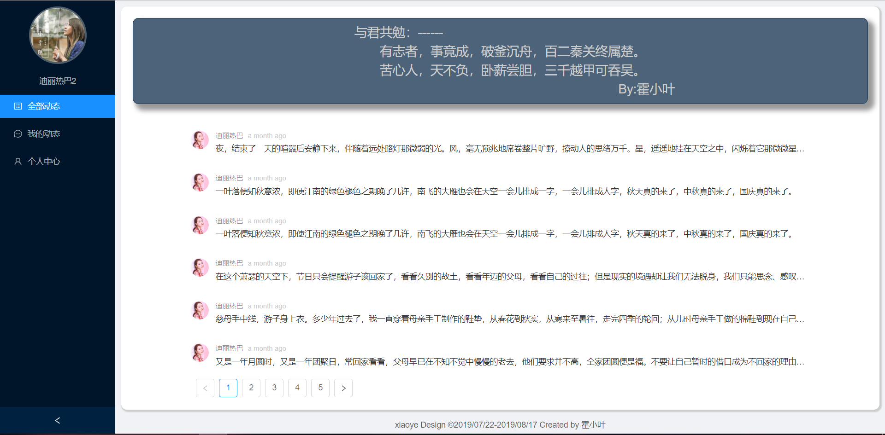
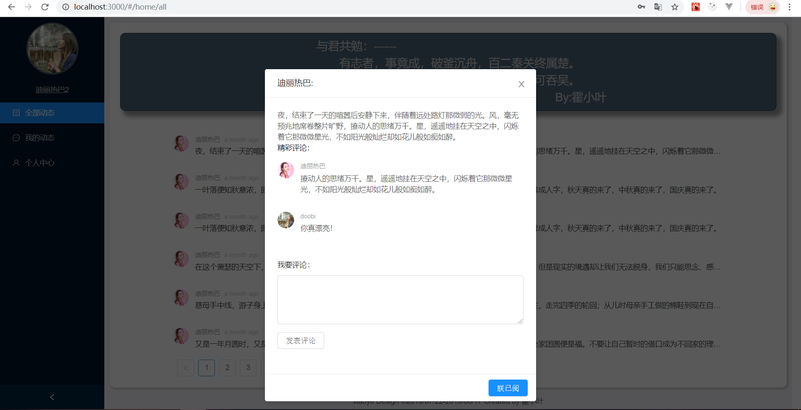
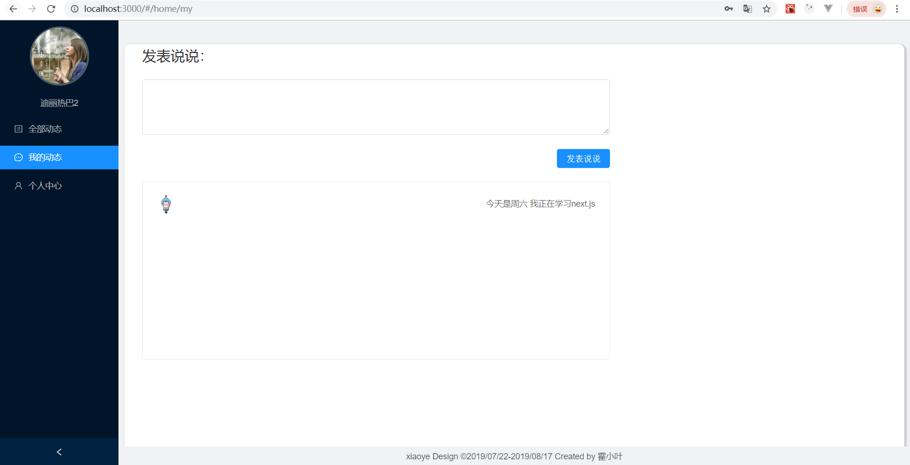
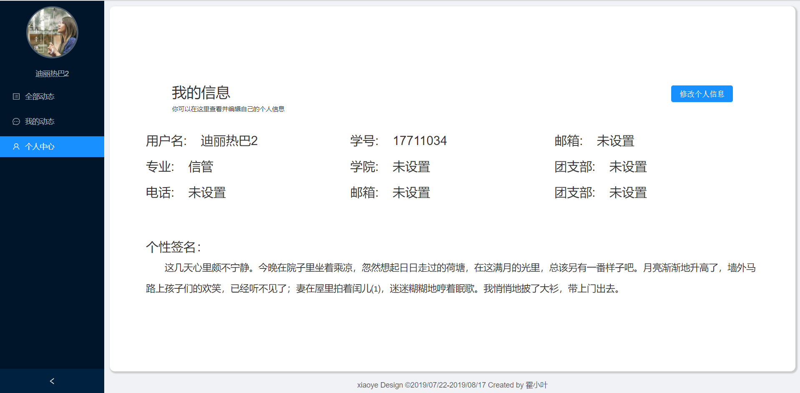
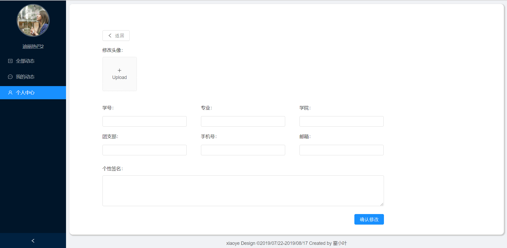

This project was bootstrapped with [Create React App](https://github.com/facebook/create-react-app).

## 想要实现功能(删除线表示已完成)
* ~~登录注册功能~~
* ~~首页分页动态渲染动态~~
* ~~修改头像~~
* ~~修改个人信息~~
* ~~管理个人动态~~
* ~~对动态评论~~
* 对动态点赞
* 查看他人信息
* 点对点发送消息
* 未完待补

## 效果图
* 
> 支持登录和创建新的用户
* 
> 支持分页数据和切换时的loading
* 
> 点击每一条说说就可以进入说说详情页面，支持对说说的评论
* 
> 发表自己的说说
* 
> 查看个人信息
* 
> 修改个人信息，包括头像的修改
